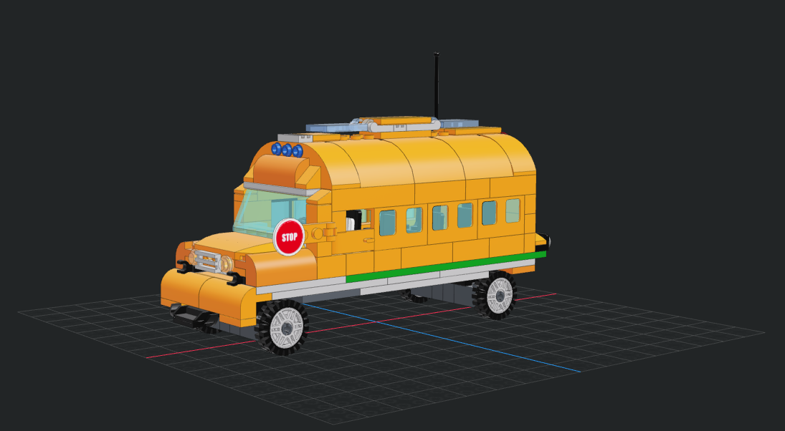
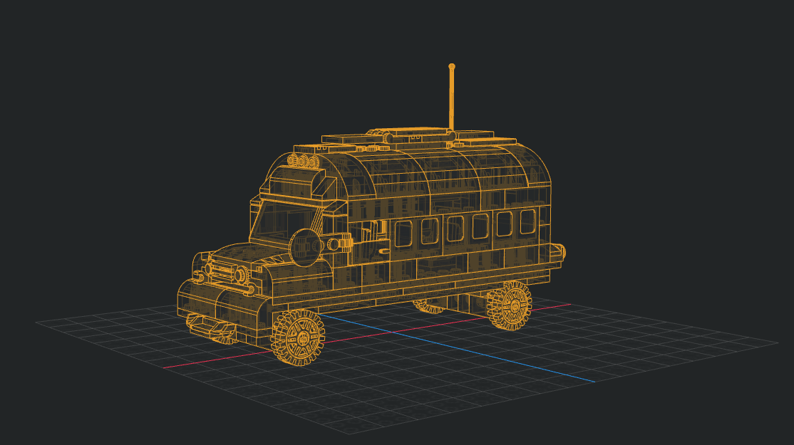
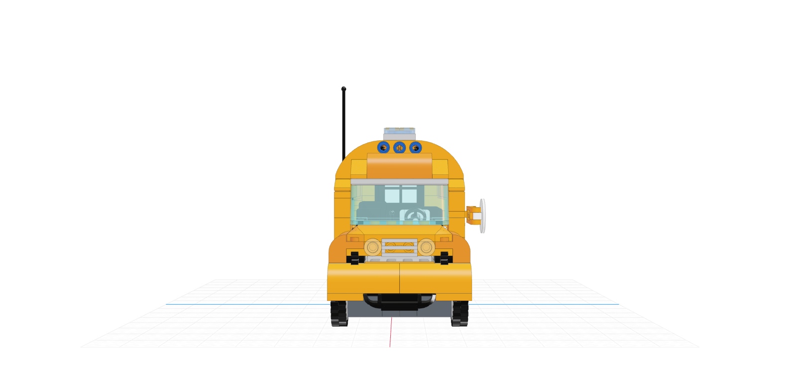
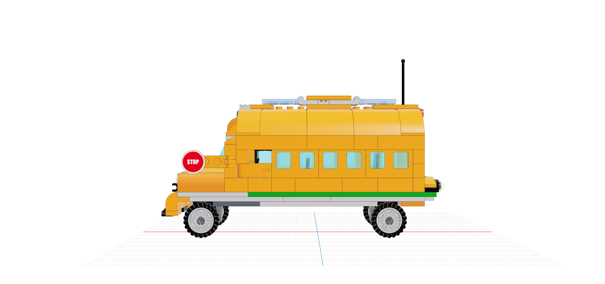
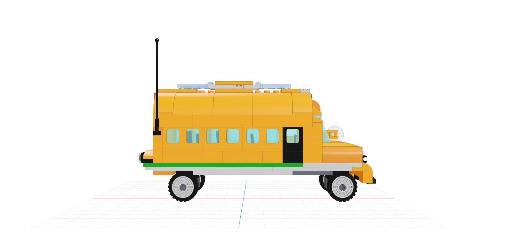
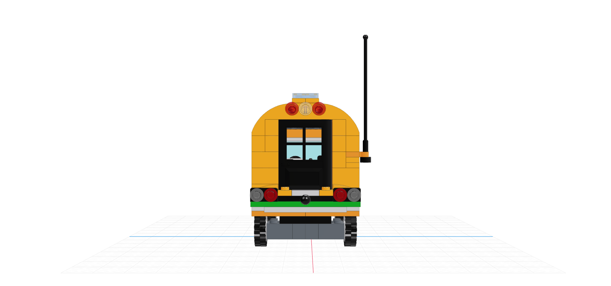
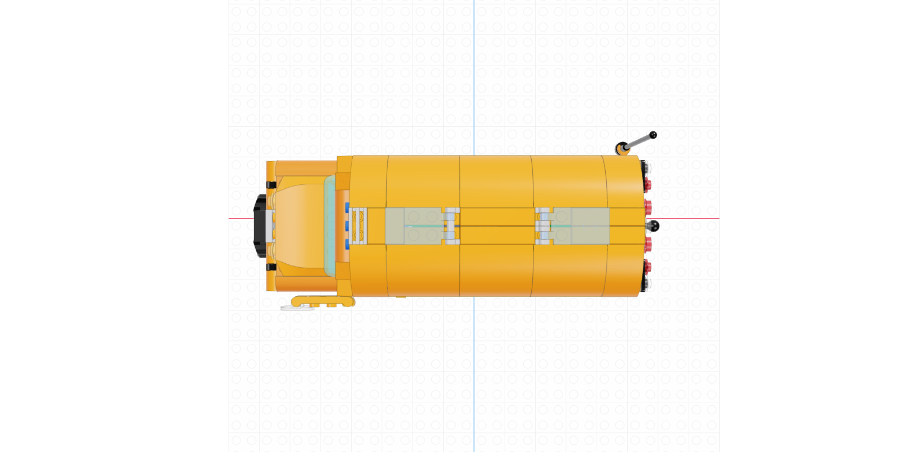
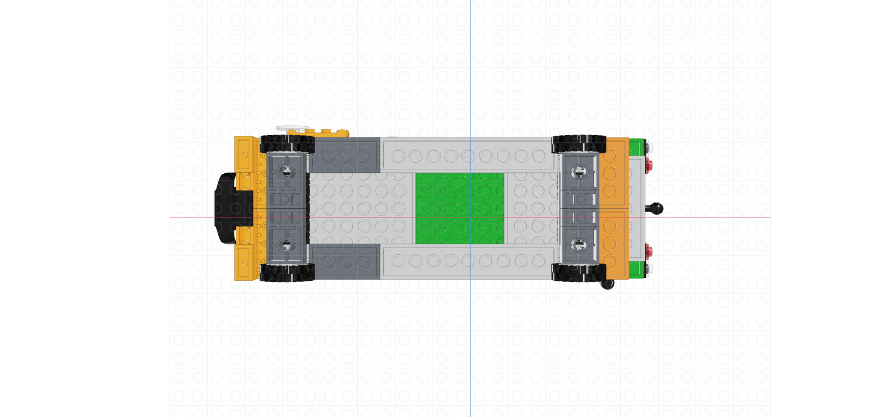

# Lego School Bus Model

A model of a School Bus built with Legos in 2015 which I decided to backup digitally.

</img>
</img>

</img>
</img>
</img>
</img>
</img>
</img>

## Caviats

In original physical model [4182](https://www.bricklink.com/v2/catalog/catalogitem.page?P=4182#T=C) was used as a rear door, but I didn't manage to find this part's model.
